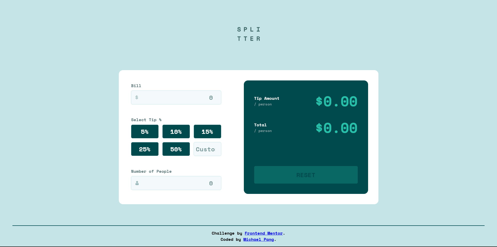

# Frontend Mentor - Tip calculator app solution

This is a solution to the [Tip calculator app challenge on Frontend Mentor](https://www.frontendmentor.io/challenges/tip-calculator-app-ugJNGbJUX). Frontend Mentor challenges help you improve your coding skills by building realistic projects.

## Table of contents

- [Frontend Mentor - Tip calculator app solution](#frontend-mentor---tip-calculator-app-solution)
  - [Table of contents](#table-of-contents)
  - [Overview](#overview)
    - [The challenge](#the-challenge)
    - [Screenshot](#screenshot)
    - [Links](#links)
  - [My process](#my-process)
    - [Built with](#built-with)
    - [What I learned](#what-i-learned)
    - [Continued development](#continued-development)
    - [Useful resources](#useful-resources)
  - [Author](#author)

## Overview

### The challenge

Users should be able to:

- View the optimal layout for the app depending on their device's screen size
- See hover states for all interactive elements on the page
- Calculate the correct tip and total cost of the bill per person

### Screenshot



### Links

- Solution URL: [https://github.com/pangm1/FrontEndMentor-Tip-Calculator-App_pangm1](https://github.com/pangm1/FrontEndMentor-Tip-Calculator-App_pangm1)
- Live Site URL: [https://front-end-mentor-tip-calculator-app.vercel.app](https://front-end-mentor-tip-calculator-app.vercel.app)

## My process

### Built with

- Semantic HTML5 markup
- CSS custom properties
- Flexbox
- CSS Grid
- Mobile-first workflow
- Vanilla Javascript

### What I learned

I tried to write as little Javascript as possible, that is, I tried to use HTML and CSS to give as much functionality to the forms as possible. 

I learned how to structure and style radio buttons and other form controls. It was hard to figure out how to transition from button states, like how I disabled the custom tip button when it was selected, and then allowed the custom tip to be entered in the same spot.

I also learned how to provide validation and error checking with forms. I made a function to modularize the error checking too. And I also manipulated the tabbing order and focus of the elements.

Here are some more specific points that I recall I learned:

- ```appearance: none``` gets rid of the default styles for inputs
- The one-line text input does not have native scrolling functionality, while ```textarea``` does. If you want a one-line text input that scrolls horizontally, you have to use a ```textarea``` with ```rows="1"```, ```white-space: nowrap```, ```resize: none```, and only an scroll overflow in the x-direction.
- ```readonly``` prevents a user from directly editing a form value, but it still can change from javascript. The element will need to be styled explicitly to be able to be visible when tabbed through.
- Hover states will still be in effect when you tab through to another element. You can prevent this by ```:hover:not(:focus-visible)``` or similar logic.
- If you use ```flex: 1``` and ```width: 100%``` on one element and ```flex: 0 0``` on another, the element with ```flex: 0 0``` will stay its original size, while the other element will take up the rest of the space.
- ```outline``` doesn't contribute to the size of the element in CSS
- In Javascript, you can access input elementd in form with Form objects. I used ```HTMLFormElement.entries[]```, which gets any control with a name or id that matches the string being accessed. This can return more than one element is they have the same name or id.
- Javascript accesses object properties by matching a string. This gave me problems when I tried to reset the form, when I had already named something else in the form 'reset'. This also manifested when I used ```addEventListener.bind()``` without using dot notation in the ```forEach``` call. On each iteration, it checks whether the object has a property called 'addEventListener', then calls it with the argument I supplied in ```.bind()```
- The 'input' event is different then 'change'. This is seen when testing it with text inputs.
- You can use ```aria-label``` if you want screenreaders to announce a control without explicitly adding a ```label``` element to the HTML.

### Continued development

During development, I should probably keep a list of new things that I learn so I have an easier time writing this.

I should also learn jQuery or a query framework eventually so I have an easier time querying the HTML elements that I need for my Javascript.

I should also get the hang of aria labels and accessibility APIs, if I want to keep focusing on accessibility.

### Useful resources

- [Pure CSS Custom Styled Radio Buttons](https://moderncss.dev/pure-css-custom-styled-radio-buttons/) - This is where I found out how to style radio buttons. This blog has a bunch of useful tutorials for learning modern CSS.

## Author

- Frontend Mentor - [@pangm1](https://www.frontendmentor.io/profile/pangm1)
